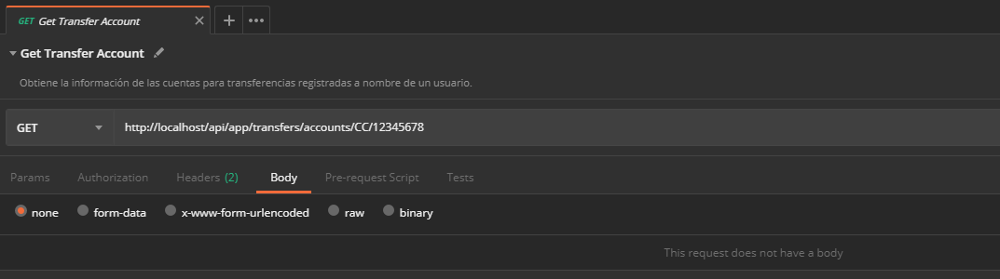
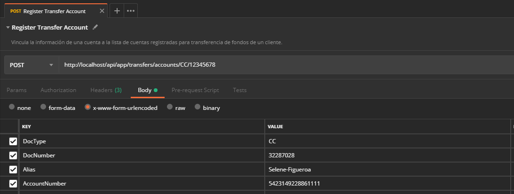
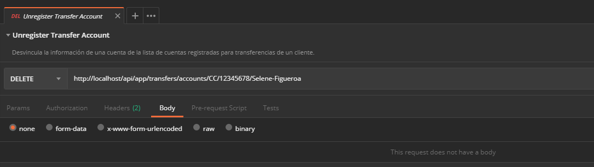

# Administrar cuentas para transferencias de un cliente

Expone las operaciones que facilitan la administración de las cuentas para transferencia de fondos de un cliente.

## Consultar cuentas registradas de un cliente

Obtiene la información de las cuentas vinculadas a un cliente para realizar transferencia de fondos.

> Cuando el cliente no tiene cuentas registradas la respuesta será una lista vacía.

Verbo | Endpoint | Requiere autenticación
:---: | -------- | :------------:
GET | http://localhost/api/app/transfers/accounts/{DocType}/{DocNumber} | [x]

### Valores de la solicitud

Campo | Tipo de dato | Descripción | Requerido
:---: | :----------: | ----------- | :-------:
{DocType} | `string` | Tipo de documento del cliente que tiene vinculadas las cuentas. Cualquier valor de la columna **Acrónimo** en el dominio de los **[Tipos de documento](Admin-CustomerTransferAccounts.md#docTypes)**. Valor esperado en la URL sin corchetes. | [x]
{DocNumber} | `string` | Número de documento del cliente que tiene vinculadas las cuentas. Valor esperado en la URL sin corchetes. | [x]

#### Ejemplo en Postman

Consultar la(s) cuenta(s) registradas del cliente identificado con el tipo de documento `CC` (Cedula de ciudadanía), número `12345678`


#### Ejemplo en curl

```curl
curl -X GET \
  http://localhost/api/app/transfers/accounts/CC/12345678 \
  -H "X-PRO-Auth-App: 1ea2e59d-0e04-4e53-883c-d8387e23443e" \
  -H "X-PRO-Auth-Payload: eyJ0eXAiOiJKV1QiLCJhbGciOiJIUzI1NiJ9.eyJOb25jZSI6ImQxZGE4ZjM4LTY3MWUtNDY1..."
```

### Datos de la respuesta

```json
[
  {
    "alias": "Paloma Veliz",
    "cardHolderName": "Paloma Veliz Chávez",
    "maskedPan": "************6526"
  },
  {
    "alias": "Doris Dueñas",
    "cardHolderName": "Doris Dueñas Urena",
    "maskedPan": "************5678"
  },
  {
    "alias": "Michelle Carrillo",
    "cardHolderName": "Michelle Carrillo Puente",
    "maskedPan": "************9101"
  }
]
```

### Valores de la respuesta

Campo | Tipo de dato | Descripción
:---: | :----------: | -----------
Alias | `string` | Nombre que identifica a la cuenta.
CardHolderName | `string` | Nombre del tarjetahabiente o titular de la cuenta.
MaskedPan | `string` | Número enmascarado de la cuenta.

## Registrar una cuenta para transferencias

Vincula la información de una cuenta a la lista de cuentas registradas para transferencia de fondos de un cliente.

Verbo | Endpoint | Requiere autenticación
:---: | -------- | :------------:
POST | /app/transfers/accounts/{DocType}/{DocNumber} | [x]

Campo | Tipo de dato | Descripción | Requerido
:---: | :----------: | ----------- | :-------:
{DocType} | `string` | Tipo de documento del cliente que tiene vinculadas las cuentas. Cualquier valor de la columna **Acrónimo** en el dominio de los **[Tipos de documento](Admin-CustomerTransferAccounts.md#docTypes)**. Valor esperado en la URL sin corchetes. | [x]
{DocNumber} | `string` | Número de documento del cliente al cual se vinculará la cuenta. Valor esperado en la URL sin corchetes. | [x]
DocType | `string` | Tipo de documento del titular asociado con la cuenta. Cualquier valor de la columna **Acrónimo** en el dominio de los **[Tipos de documento](Admin-CustomerTransferAccounts.md#docTypes)**. | [x]
DocNumber | `string` | Número de documento del titular asociado con la cuenta. | [x]
Alias | `string` | Nombre con el que se identificará a la cuenta. | [x]
AccountNumber | `string` | Número de la cuenta. | [x]

#### Ejemplo en Postman

Registrar la cuenta `5423149228861111` del titular identificado con el tipo de documento `CC` (Cedula de ciudadanía), número `32287028` utilizando el nombre `Selene-Figueroa` y asociar esta información con el cliente identificado con el tipo de documento `CC` (Cedula de ciudadanía), número `12345678`



#### Ejemplo en curl

```curl
curl -X POST http://localhost/api/app/transfers/accounts/CC/12345678 \
  -H "Content-Type: application/x-www-form-urlencoded" \
  -H "X-PRO-Auth-App: 1ea2e59d-0e04-4e53-883c-d8387e23443e" \
  -H "X-PRO-Auth-Payload: eyJ0eXAiOiJKV1QiLCJhbGciOiJIUzI1NiJ9.eyJOb25jZSI6ImJjZTE5M2VlLTY0Y2QtNDhjMC05NzY..." \
  -d "DocType=CC&DocNumber=32287028&Alias=Selene-Figueroa&AccountNumber=5423149228861111"
```

### Datos de la respuesta

Código de estado de HTTP de acuerdo con la especificación **[RFC 2616](https://www.w3.org/Protocols/rfc2616/rfc2616-sec10.html)** ([Valores de respuesta más utilizados](Admin-CustomerTransferAccounts.md#httpStatusCodes))

## Eliminar una cuenta registrada

Desvincula la información de una cuenta de la lista de cuentas registradas para transferencias de un cliente.

Verbo | Endpoint | Requiere autenticación
:---: | -------- | :------------:
DELETE | /app/transfers/accounts/{DocType}/{DocNumber}/{Alias} | [x]

### Valores de la solicitud

Campo | Tipo de dato | Descripción | Requerido
:---: | :----------: | ----------- | :-------:
{DocType} | `string` | Tipo de documento del cliente que tiene vinculadas las cuentas. Cualquier valor de la columna **Acrónimo** en el dominio de los **[Tipos de documento](Admin-CustomerTransferAccounts.md#docTypes)**. Valor esperado en la URL sin corchetes. | [x]
{DocNumber} | `string` | Número de documento ddel cliente que tiene vinculadas las cuentas. Valor esperado en la URL sin corchetes. | [x]
{Alias} | `string` | Nombre con el que se identifica a la cuenta vinculada. Valor esperado en la URL sin corchetes. | [x]

#### Ejemplo en Postman

Eliminar el registro de la cuenta identificada con el nombre `Selene-Figueroa` asociada con el cliente identificado con el tipo de documento `CC` (Cedula de ciudadanía), número `12345678`



#### Ejemplo en curl

```curl
curl -X DELETE \
  http://localhost/api/app/transfers/accounts/CC/12345678/Selene-Figueroa \
  -H "X-PRO-Auth-App: 1ea2e59d-0e04-4e53-883c-d8387e23443e" \
  -H "X-PRO-Auth-Payload: eyJ0eXAiOiJKV1QiLCJhbGciOiJIUzI1NiJ9.eyJOb25jZSI6ImM0Y2JiMWU2LWE0MGMtNGJkNi04MGFj..."
```

### Datos de la respuesta

Código de estado de HTTP de acuerdo con la especificación **[RFC 2616](https://www.w3.org/Protocols/rfc2616/rfc2616-sec10.html)** ([Valores de respuesta más utilizados](Admin-CustomerTransferAccounts.md#httpStatusCodes))
## Anexos

### Valores de respuesta más utilizados

<div id="httpStatusCodes"></div>

HttpStatus | Tipo de dato | Descripción
:--------: | :----------: | -----------
200 | `int` | La solicitud finalizó satisfactoriamente.
406 | `int` | Alguno de los valores esperados no cumple con las validaciones.
409 | `int` | No se encuentra información de la cuenta para vincular con los datos suministrados.

### Tipos de documento

<div id="docTypes"></div>

Acrónimo | Descripción
:------: | -----------
CC | Cédula de Ciudadanía
NIT | Número de Identificación Tributaria
TI | Tarjeta de Identidad
CE | Cédula de Extranjería
PAS | Pasaporte

## Información relacionada

- [Solicitar un token de autenticación](JWT-Request.md)
- [Mensajes de respuesta en Aspen](Responses.md)
