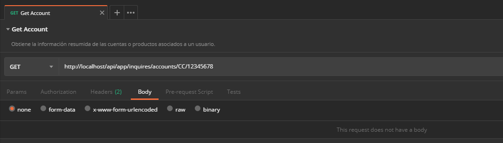
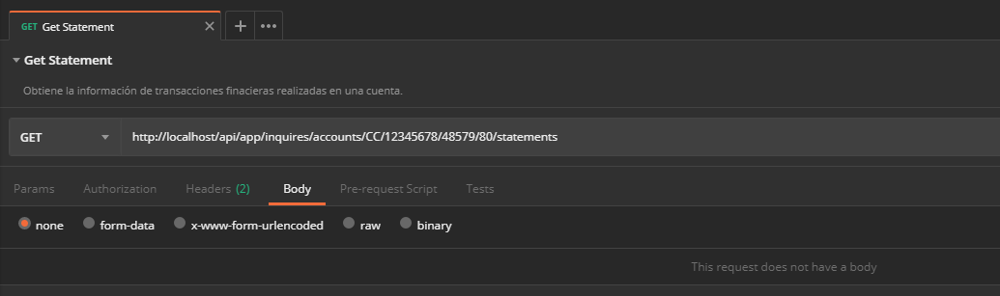

# Consultas de productos financieros de un cliente

Expone las operaciones de consulta sobre los productos financieros de un usuario.

## Consultar productos disponibles de un cliente

Obtiene la información resumida de las cuentas o productos  asociados a un usuario.

> Cuando el cliente no tiene productos asociados la respuesta será una lista vacía.

Verbo | Endpoint | Requiere autenticación
:---: | -------- | :--------------------:
GET | http://localhost/api/app/inquires/accounts/{DocType}/{DocNumber} | [x]

### Valores de la solicitud

Campo | Tipo de dato | Descripción | Requerido
:---: | :----------: | ----------- | :-------:
{DocType} | `string` | Tipo de documento del cliente. Cualquier valor de la columna **Acrónimo** en el dominio de los **[Tipos de documento](Inquiries-CustomerAccounts.md#docTypes)**. Valor esperado en la URL sin corchetes. | [x]
{DocNumber} | `string` | Número de documento del cliente. Valor esperado en la URL sin corchetes. | [x]

#### Ejemplo en Postman

Consultar la(s) cuenta(s) del tipo de documento `CC` (cédula de ciudadanía) y número `12345678`.


#### Ejemplo en curl

```curl
curl -X GET \
  http://localhost/api/app/inquires/accounts/CC/12345678 \
  -H "X-PRO-Auth-App: 1ea2e59d-0e04-4e53-883c-d8387e23443e" \
  -H "X-PRO-Auth-Payload: eyJ0eXAiOiJKV1QiLCJhbGciOiJIUzI1NiJ9.eyJOb25jZSI6IjE3MWU2YTY2LTUzNzUtNDUXffgfs..."
```

### Datos de la respuesta

```json
[
  {
    "id": "48579",
    "balance": 10000,
    "maskedPan": "************9836",
    "order": 0,
    "name": "Tarjeta Multibolsillo",
    "source": 0,
    "sourceAccountId": null,
    "properties": [
      {
        "label": "Última transacción",
        "key": "LastTranName",
        "value": "Consulta Ultimos Movimientos"
      },
      {
        "label": "Fecha",
        "key": "LastTranDate",
        "value": "nov 2 de 2018 a las 4:06 PM"
      },
      {
        "label": "Lugar",
        "key": "LastTranCardAcceptor",
        "value": "Almacen San Juan"
      }
    ]
  },
  {
    "id": "1594546",
    "balance": 205000,
    "maskedPan": "************0546",
    "order": 0,
    "name": "Crédito Libre Inversión",
    "source": 1,
    "sourceAccountId": "1594546",
    "properties": [
      {
        "label": "Cupo disponible",
        "key": "AvailableBalance",
        "value": "$2.972.730"
      },
      {
        "label": "Fecha de pago",
        "key": "PaymentDate",
        "value": "nov 29 de 2018"
      },
      {
        "label": "Fecha de corte",
        "key": "CutoffDate",
        "value": "nov 13 de 2018"
      }
    ]
  }
]
```

### Valores de la respuesta

Campo | Tipo de dato | Descripción
:---: | :----------: | -----------
Id | `string` | Identificador unívoco de la cuenta.
Balance | `decimal` | Valor del saldo actual de la cuenta.
MaskedPan | `string` | Número enmascarado de la cuenta.
Order | `int` | Orden del elemento para visualizar en interfaz de usuario.
Properties | `list` | Es un conjunto de propiedades o atributos que representan información adicional de la cuenta. [Propiedades de una cuenta](Inquiries-CustomerAccounts.md#accountProperties)
Source | `int` | Define los sistemas reconocidos desde donde se originaron los datos de la cuenta. [Tipos de sistemas](Inquiries-CustomerAccounts.md#subsystems)
SourceAccountId | `string` | Identificador de la cuenta que se utilizará en procesos transaccionales

#### Propiedades de una cuenta

<div id="accountProperties"></div>

Las propiedades representan información resumida por alguna característica de la cuenta.

Campo | Tipo de dato | Descripción
:---: | :----------: | -----------
Label | `string` | Nombre o etiqueta para visualizar el contenido del atributo en interfaz de usuario.
Key | `string` | Identificador interno del atributo.
Value | `string` | Valor asociado con el atributo.

<div class="admonition warning">
   <p class="first admonition-title">Atención</p>
   <p class="last">El conjunto de propiedades o atributos de una cuenta pueden variar de acuerdo con el sistema de origen del producto.</p>
</div>

#### Tipos de sistemas

<div id="subsystems"></div>

Valor | Nombre | Descripción
:---: | :----: | -----------
`0` | Tup | El origen de la información es el sistema de administración de tarjetas débito **TUP**.
`1` | Bancor | El origen de la información es sistema de administración de cartera **BANCOR**.
`2` | None | No hay un sistema definido. La información se puede utilizar con la finalidad de comprobar el funcionamiento del servicio, mientras se finalizan los acuerdos comerciales que permitan a los clientes del API, consumir la información real de los sistemas transaccionales. 

## Consultar saldos de una cuenta

Obtiene los saldos (balances) detallados de una cuenta débito.

> Cuando la cuenta del cliente no tiene saldos asociados la respuesta será una lista vacía.

Verbo | Endpoint | Requiere autenticación
:---: | -------- | :--------------------:
GET | http://localhost/app/inquires/accounts/{DocType}/{DocNumber}/{AccountId}/balances | [x]

### Valores de la solicitud

Campo | Tipo de dato | Descripción | Requerido
:---: | :----------: | ----------- | :-------:
{DocType} | `string` | Tipo de documento del cliente. Cualquier valor de la columna **Acrónimo** en el dominio de los **[Tipos de documento](Inquiries-CustomerAccounts.md#docTypes)**. Valor esperado en la URL sin corchetes. | [x]
{DocNumber} | `string` | Número de documento del cliente. Valor esperado en la URL sin corchetes. | [x]
{AccountId} | `string` | Identificador de la cuenta para la que se obtienen los saldos (Corresponde con el valor del atributo `Id` de la respuesta de la consulta de cuentas). Valor esperado en la URL sin corchetes. | [x]

#### Ejemplo en Postman

Consultar los saldos de la cuenta `48579` asociada con el tipo de documento `CC` (cédula de ciudadanía) y número `12345678`.


#### Ejemplo en curl

```curl
curl -X GET \
  http://localhost/api/app/inquires/accounts/CC/12345678/48579/balances \
  -H "X-PRO-Auth-App: 1ea2e59d-0e04-4e53-883c-d8387e23443e" \
  -H "X-PRO-Auth-Payload: eyJ0eXAiOiJKV1QiLCJhbGciOiJIUzI1NiJ9.eyJOb25jZSI6ImZmZmRiZGU3LWE5OWYtNGQxOS05ODcU0D..."
```

### Datos de la respuesta

```json
[
  {
    "balance": 1000,
    "number": "**************0180",
    "sourceAccountId": "48579|80",
    "typeId": "80",
    "typeName": "Monedero General"
  },
  {
    "balance": 1000,
    "number": "**************0181",
    "sourceAccountId": "48579|81",
    "typeId": "81",
    "typeName": "Subsidio familiar"
  },
  {
    "balance": 1000,
    "number": "**************0182",
    "sourceAccountId": "48579|82",
    "typeId": "82",
    "typeName": "Subsidio Educativo"
  },
  {
    "balance": 1000,
    "number": "**************0183",
    "sourceAccountId": "48579|83",
    "typeId": "83",
    "typeName": "Bonos"
  },
  {
    "balance": 1000,
    "number": "**************0184",
    "sourceAccountId": "48579|84",
    "typeId": "84",
    "typeName": "Viveres General"
  }
]
```

### Valores de la respuesta

Campo | Tipo de dato | Descripción
:---: | :----------: | -----------
Balance | `decimal` | Valor del saldo actual de la cuenta.
Number | `string` | Número enmascarado de la cuenta.
SourceAccountId | `string` | Identificador de la cuenta que se utilizará en procesos transaccionales.
TypeId | `string` | Identificador del tipo de cuenta.
TypeName | `string` | Nombre del tipo de cuenta.

## Consultar movimientos de una cuenta

Obtiene la información de transacciones finacieras realizadas en una cuenta.

> Cuando la cuenta no presenta movimientos la respuesta será una lista vacía.

Verbo | Endpoint | Requiere autenticación
:---: | -------- | :--------------------:
GET | http://localhost/app/inquires/accounts/{DocType}/{DocNumber}/{AccountId}/{AccountTypeId}/statements | [x]

### Valores de la solicitud

Campo | Tipo de dato | Descripción | Requerido
:---: | :----------: | ----------- | :-------:
{DocType} | `string` | Tipo de documento del cliente. Cualquier valor de la columna **Acrónimo** en el dominio de los **[Tipos de documento](Inquiries-CustomerAccounts.md#docTypes)**. Valor esperado en la URL sin corchetes. | [x]
{DocNumber} | `string` | Número de documento del usuario. Valor esperado en la URL sin corchetes. | [x]
{AccountId} | `string` | Identificador de la cuenta para la que se obtienen los saldos (Corresponde con el valor del atributo `Id` de la respuesta de la consulta de cuentas). Valor esperado en la URL sin corchetes. | [x]
{AccountTypeId} | `string` | Identificador del tipo de cuenta. **Aplica para las cuentas débito**. (Corresponde con el valor del atributo `TypeId` de la respuesta de la consulta de saldos) Puede usar asterisco (`*`) para consultar los últimos movimientos de todo el producto. Valor esperado en la URL sin corchetes. |

#### Ejemplo en Postman

Consultar los movimientos financieros de la cuenta `48579` asociadas con el tipo de documento `CC` (cédula de ciudadanía) y número `12345678`, para el tipo de cuenta `80`.


#### Ejemplo en curl

```curl
curl -X GET \
  http://localhost/api/app/inquires/accounts/CC/12345678/48579/80/statements \
  -H "X-PRO-Auth-App: 1ea2e59d-0e04-4e53-883c-d8387e23443e" \
  -H "X-PRO-Auth-Payload: eyJ0eXAiOiJKV1QiLCJhbGciOiJIUzI1NiJ9.eyJOb25jZSI6IjkyZjhjODE4LTBiOTUtNGJjNy1iZWFiLW..."
```

### Datos de la respuesta

```json
[
  {
    "tranType": "40",
    "cardAcceptor": "Almacen San Juan",
    "date": "2018-11-19T11:53:57.1900000-05:00",
    "amount": 1000,
    "tranName": "Transferencia",
    "category": 0,
    "accountTypeId": "80",
    "accountTypeName": "Monedero General"
  },
  {
    "tranType": "40",
    "cardAcceptor": "Almacen San Juan",
    "date": "2018-11-19T11:53:17.6230000-05:00",
    "amount": 1000,
    "tranName": "Transferencia",
    "category": 0,
    "accountTypeId": "80",
    "accountTypeName": "Monedero General"
  },
  {
    "tranType": "40",
    "cardAcceptor": "Almacen San Juan",
    "date": "2018-11-14T17:22:15.4630000-05:00",
    "amount": 1000,
    "tranName": "Transferencia",
    "category": 0,
    "accountTypeId": "80",
    "accountTypeName": "Monedero General"
  }
]
```

### Valores de la respuesta

Campo | Tipo de dato | Descripción
:---: | :----------: | -----------
AccountTypeId | `string` | Identificador del tipo de cuenta que afectó el movimiento/transacción.
AccountTypeName | `string` | Nombre del tipo de cuenta que afectó el movimiento/transacción.
Amount | `decimal` | Valor por el que se realizó el movimiento/transacción.
CardAcceptor | `string` | Nombre del comercio donde se realizó el movimiento/transacción.
Category | `int` | Define la naturaleza contable de la transacción finaciera. **[Tipos de categoria](Inquiries-CustomerAccounts.md#categories)**
Date | `datetime` | Fecha y hora en que se realizó el movimiento/transacción.
TranName | `string` | Nombre que representa el tipo de movimiento/transacción.
TranType | `string` | Código que representa el tipo de movimiento/transacción.

#### Tipos de categoria

<div id="categories"></div>

Valor | Nombre | Descripción
:---: | :----: | -----------
`0` | Debit | La operación es de tipo débito.
`1` | Credit | La operación es de tipo crédito.

## Anexos

<a name="DocTypes"></a> 
### Tipos de documento

<div id="docTypes"></div>

Acrónimo | Descripción
:------: | -----------
CC | Cédula de Ciudadanía
NIT | Número de Identificación Tributaria
TI | Tarjeta de Identidad
CE | Cédula de Extranjería
PAS | Pasaporte

## Información relacionada

- [Solicitar un token de autenticación](JWT-Request.md)
- [Mensajes de respuesta en Aspen](Responses.md)
