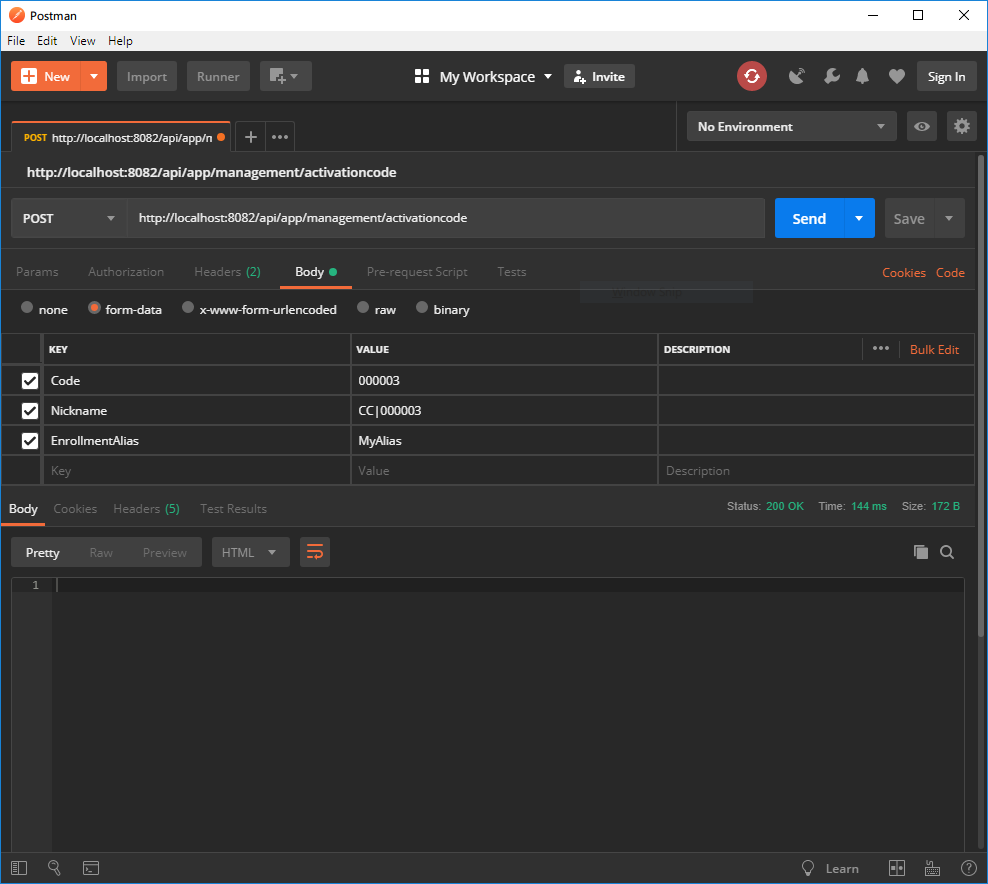

# Validar códigos de activación (SMS)

## Contexto 

Un código de activación es un contraseña de un solo uso (compuesta por varios digitos, <*generalmente enre cuatro y seis*>) que se puede utilizar para `autenticar` a un usuario. Funciona como un [OTP](https://en.wikipedia.org/wiki/One-time_password), asociado con el identificador de un usuario en una institución. Por ejemplo, la institución ACME podria generar el código de activación *999999,* para el usuario identificado con el documento ABC.

Para un escenario como este, **Aspen** puede validar que el código proporcionado con el usuario ABC, corresponde con el emitido por la entidad ACME.

>  Nota: La generación y almacenamiento de los códigos de activación y su asociación con los usuarios no forman parte de los servicios públicos expuestos por Aspen, por lo tanto no estarán documentados en este sitio.

## Validación de un código de activación

Permite validar si el código de activación proporcionado por un usuario, corresponde con el mismo código emitido por una entidad. Para validar un código debe invocar el siguiente endpoint.

| Verbo | Endpoint                                           | Requiere autenticación |
| :---: | -------------------------------------------------- | :--------------------: |
| POST  | http://localhost/api/app/management/activationcode |          [x]           |

### Valores de la solicitud (Body)

|      Campo      | Tipo de dato | Descripción                                                  | Requerido |
| :-------------: | :----------: | ------------------------------------------------------------ | :-------: |
|      Code       |    `string`    | Código que se desea verificar. Generalmente se trata de un valor compuesto por entre cuatro y seis dígitos. La longitud puede variar entre países y entre entidades. Ejemplo: 000000 |    [ X ]    |
|    Nickname     |    `string`    | Identificador del usuario en la entidad para la que se generó el código de activación. En Colombia, generalmente corresponde a la unión del tipo de documento con el número de documento del usuario en cuestión. Puede variar entre países y entre entidades. Ejemplo: CC-123456789 |    [ X ]    |
| EnrollmentAlias |    `string`    | Identificador que se desea asociar con el usuario, cuando la validación del código de autenticación es exitosa. Permite establecer un `alias` para el usuario en la entidad. Si no se proporciona un valor, se utiliza el valor de `nickname` como alias. Este alias se puede utilizar más adelante para volver al valor del `nickname` en caso de ser necesario. Ejemplo: MyUser123 |    [ ]    |
|ChannelId| `string` |Identificador del canal desde donde se realiza la validación del código de activación. Este valor es opcional y será proporcionado por Processa de ser necesario.|[ ]|

### Ejemplo en Postman

### Datos de la respuesta

Código de estado de HTTP de acuerdo con la especificación [RFC 2616](https://www.w3.org/Protocols/rfc2616/rfc2616-sec10.html)

### Valores de respuesta más utilizados

| HttpStatus | Tipo de dato | Descripción                                                  |
| :--------: | :----------: | ------------------------------------------------------------ |
|    200     |     `int`      | El código de activación es valido. Se asocio el valor de `alias` con `nickname` y se marcó como utilizado el código de activación. |
|    417     |     `int`      | El código de activación no es valido, ha excedido el número de intentos permitidos, necesita esperar algunos segundos para intentar de nuevo o no se encontraron datos con los valores proporcionados. El campo `ReasonPhrase` contiene un mensaje que describe de forma detallada el resultado. |

