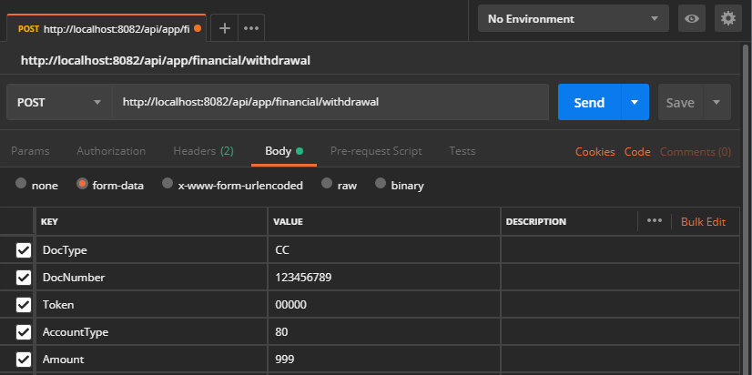

# Retiro con token

Procesa una solicitud financiera de retiro, utilizando un token transaccional como método de validación.

| Verbo | Endpoint                                      | Requiere autenticación |
| :---: | --------------------------------------------- | :--------------------: |
| POST  | http://localhost/api/app/financial/withdrawal |          [ Si ]           |

[^Segmentos de URL]: La información entre corchetes en la URL se denomina segmentos de URL y aplican solo para algunas operaciones. Cuando aparezcan en un ejemplo, deben ser reemplazados por sus valores correspondientes omitiendo los corchetes. Por ejemplo, sin en la URL de ejemplo apareciera http://localhost/api/operation/value/{value}, para establecer el valor de  `value` en la solicitud a la cadena `abc`, la URL final se vería de la siguiente forma: http://localhost/api/operation/value/abc 

## Datos de la solicitud (body)

```json
{
  "DocType": "CC",
  "DocNumber": "123456789",
  "Token": "000000",
  "AccountType": "80",
  "Amount": 99999,
  "Metadata" : "RANDOM_DATA_BY_ACQUIRER"
}
```

### Valores de la solicitud

Campo | Tipo de dato | Descripción | Requerido
:---: | :--------: | ------------ | :-----:
DocType | string | [Tipo de documento](Inquiries-CustomerAccounts.md#DocTypes) del usuario para el que se generó el token transaccional. | [ Si ]
DocNumber | string | Número de documento del usuario para el que se generó el token transaccional. | [ Si ]
Token | string | Valor del token transaccional generado para el usuario. Generalmente le será entregado en un mensaje SMS. | [ Si ]
AccountType | string | Identificador del tipo de cuenta de donde se toman los fondos para la transacción. Generalmente este valor lo debe "*ingresar/seleccionar/establecer*" el usuario y/o comercio en el punto de pago. Corresponde con una lista de valores predefinidos por Processa. | [ Si ]
Amount | int | Valor de la transacción (retiro). Cantidad de dinero que se desea autorizar. | [ Si ]
Metadata | string | Metadatos asociados personalizados para el [TPS](Tokenization/#tps). | [Opcional] 

## Datos de la respuesta

> Si al procesar la respuesta del servicio está utilizando un serializador que distinga mayúsculas y minúsculas, tenga en cuenta que Aspen genera todas sus respuestas utilizando el formato conocido como [LowerCamelCase](https://en.wikipedia.org/wiki/Camel_case)

Esta operación no retorna información adicional al código de estado de HTTP de acuerdo con la especificación [RFC 2616](https://www.w3.org/Protocols/rfc2616/rfc2616-sec10.html). Si la respuesta no es `HttpStatus` 200, en el campo  `ReasonPhrase` de la respuesta encontrará un mensaje que describe de forma detallada el resultado de la operación.

### Valores de respuesta más utilizados

HttpStatus | Tipo | Descripción
:---: | :--------: | ------------
200 | int | El token de retiro se validó satisfactoriamente y se realizó el descuento de los fondos monetarios en la cuenta del usuario. 
404 | int | El token de retiro no existe, no es válido o ya expiró. 
406 | int | El token de retiro se validó satisfactoriamente, pero el autorizador financiero denegó la transacción.  

<div class="admonition info">
   <p class="first admonition-title">Nota</p>
   <p class="last">Indiferentemente al código de la respuesta, el token transaccional utilizado se invalidará, ya que se trata de un <a href="https://en.wikipedia.org/wiki/One-time_password" target="_blank">OTP</a>.</p>
</div>


## Ejemplo en Postman



## Información relacionada

- [Generar un token de autenticación](Generate-Token.md)

- [Registro de aplicaciones](App_Register.md)

- [Mensajes de respuesta](Responses.md)

- [Tipos de documentos reconocidos](Inquiries-CustomerAccounts.md#DocTypes)

  

